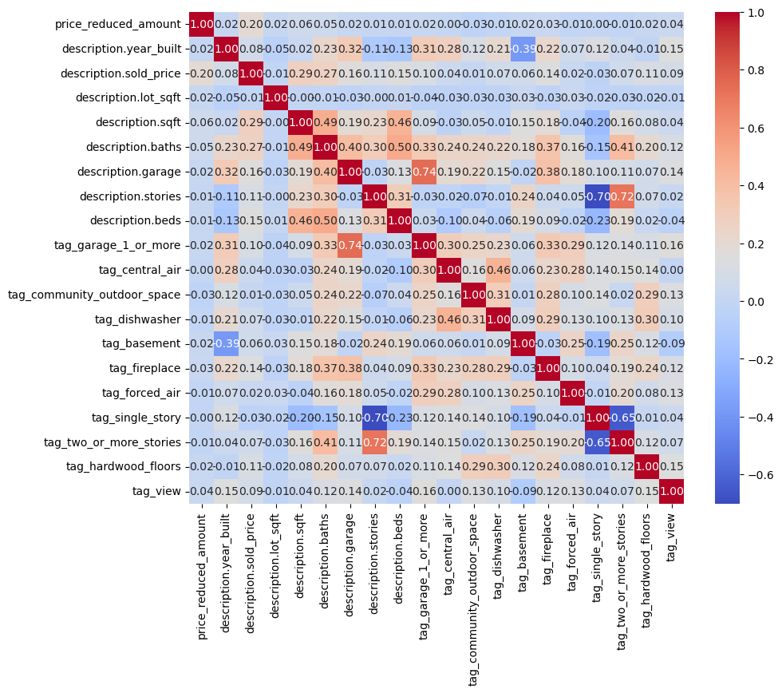
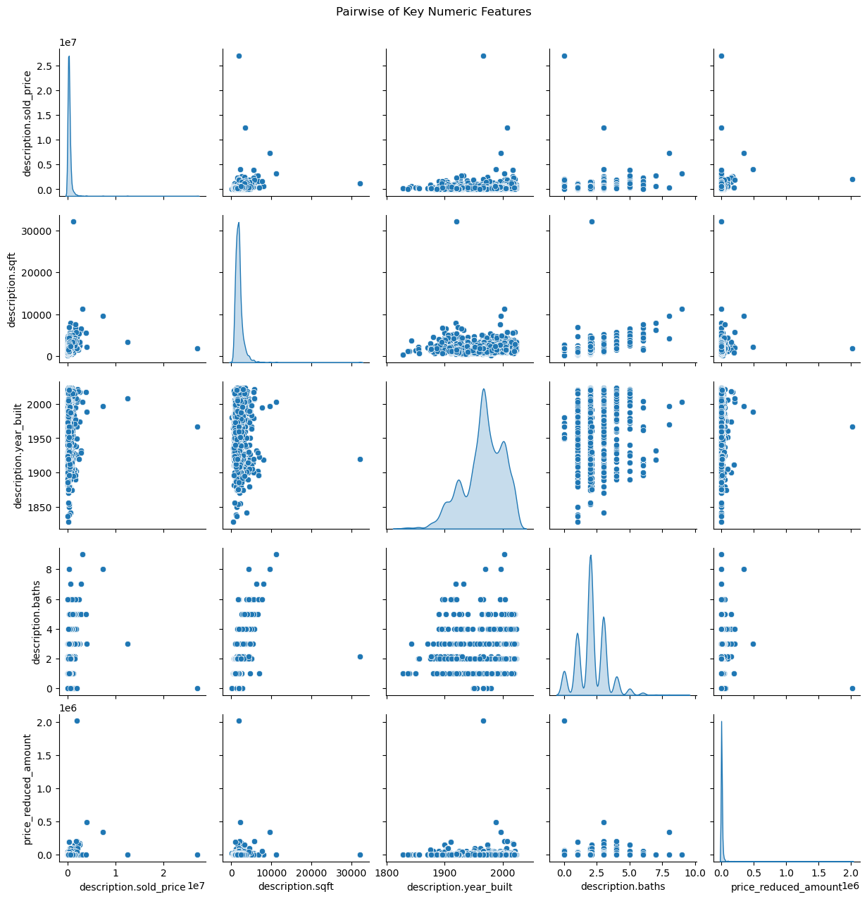
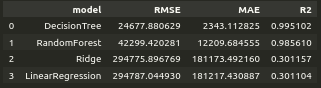

## Project/Goals
This inquiry aims to use pre-existing US house sales data to create a predictive model
to accurately gauge future house prices.

## Process

### Phase I Knowing the data

- Open housing information inside of JSON files
- Checked file structure and made a function to loop through all JSON files and extract house data
- All house data was then grouped and converted into a normalized dataframe
- We dropped unnecessary columns were then dropped, and null values replaced

- tags were then parsed, everything except the 10 most frequent tags were dropped and finally encoded 
- Mean city & state sale prices were calculated and encoded into the train data to keep track of the location without making custom encodings for each city and state.

### Phase II Visualize the data
- We created a heatmap, and pairwise plots were created to view the correlation between the different features in the dataframe

### Phase III  Model Selection and Training

Initial Modeling:
- Started by isolating only the numeric columns from the preprocessed dataset.
- A simple median imputer was used to fill any remaining missing values.

Selection:
- Four different regressor models were tested
* Linear Regression
* Ridge Regression
* Decision Tree
* Random Forest

Training & hold-out evaluation:
* Each model was fit on the training split
* Then evaluated on the hold-out test set using RMSE, MAE, and R².
* This provides a clear, apples-to-apples comparison of "out-of-sample" prior to tuning.
* The Random Forrest emerged as our strongest baseline and model of interest for tuning.

The Random Forest gives the best generalization performance( lowest true test RMSE and a high R²) because it balances flexibility (learning complex patterns) with stability(using average trees to avoid overfitting).

### Phase IV Model Tuning

- We began by re‐loading our already‐scaled training and test splits from CSV and fitting a median SimpleImputer on the training set to fill any remaining missing values (then transforming both train and test).

- We defined a grid of three key Random Forest hyperparameters—number of trees (n_estimators), maximum tree depth (max_depth), and minimum samples per leaf (min_samples_leaf)—and used scikit-learn’s GridSearchCV (with five‐fold cross‐validation and the built-in “neg_root_mean_squared_error” scorer) to exhaustively evaluate every combination.

- The search identified {'n_estimators': 100, 'max_depth': 20, 'min_samples_leaf': 2} as optimal, yielding an average CV RMSE of about 410 120 and a final hold-out test RMSE of roughly 525 312.

### Phase V Pipeline Creation
 Armed with those tuned settings, we then constructed a two‐step Pipeline—first imputing missing values, then fitting the RandomForestRegressor with our best parameters—on the full training set. 

Finally, we serialized both the best estimator (best_random_forest.pkl) and the complete pipeline (final_pipeline.pkl) using joblib.dump, creating a self‐contained, drop-in model that can accept new data and immediately output predictions without any further manual preprocessing.

## Results

After having hypertuned and corrected any underlying discrepancies with custom cross-validations the current iteration of our model doesn't yield a strong enough success rate to warrent commercial use.

Fitting 5 folds for each of 27 candidates, totaling 135 fits
🔍 Best params: {'max_depth': 20, 'min_samples_leaf': 2, 'n_estimators': 100}
🔍 Best CV RMSE: 410,120.31
🏁 Final Test RMSE: 525,311.80

## Challenges 
The biggest challenge in this project was manipulating the data into a workable dataframe for analysis while minimizing loss of useful data.The source files had a lot of redundant features and null values that necessacitated multiple rounds of trimming, null replacements, and encoding to be fed to ML models.

## Future Goals
A way to increase the success rate of the current MVP model would be to include socioeconomic data from the cities and states. As they could be factors that weight more in the areas home evaluation.